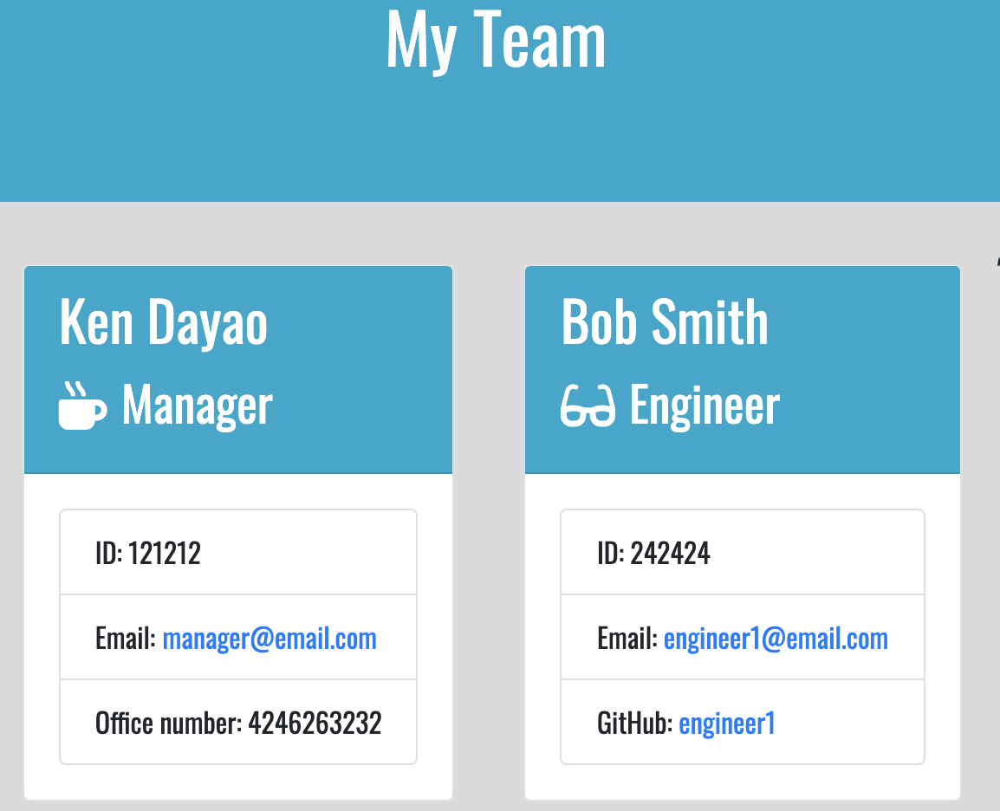

# Team-Profile-Generator

## Description

Team Profile Generator is a command line interface application that generates and displays the software engineering team onto a webpage based on the user input.  This application prompts a user for information about their team (manager, engineer, intern). Then the application displays the team members information on an HTML page.

## Table of Contents

* [Description](#description)
* [Technology](#technology)
* [User Story](#user-story)
* [Installation](#installation)
* [Usage](#usage)
* [License](#license)
* [Contributing](#contributing)
* [Tests](#tests)
* [Questions](#questions)
* [Deployed Application](#deployed-application)

## Technology

- HTML
- CSS 
- Bootstrap
- Node
- Objected Oriented Programming
- JavaScript
- Jest (code testing)

## User Story

As a manager
I want to generate a webpage that displays my team's basic info
so that I have quick access to emails and GitHub profiles

## Installation

You will need to do a npm install in order to install inquirer and jest testing.

## Usage

In Git Bash or Terminal, type in node app.js. Answer the questions about your team, then the application will render a team.html file that will display your team members.

## License

## Contributing

Please follow standard contributing guidelines.

## Tests

npm test (testing with jest)

## Questions

For any questions, please contact kendayao at kendayao@gmail.com

## Deployed Application 

Video of deployed application: https://youtu.be/9Ur1j38NJ8U

